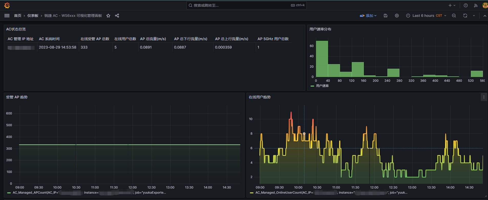
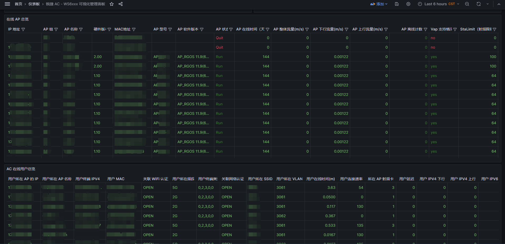

<p align="center"></p><h1 align="center">YuukaChan-Ruijie-WS6xxx-Exporter</h1><h4 align="center">优香酱系列小工具——锐捷AC WS6xxx 系列 Prometheus Exporter ，附带 Grafana 仪表盘模板 | HayaseYuuka Ruijie AC WS6xxx Series Prometheus Exporter With Grafana Template Included</h4><hr/>

# 功能简介

这只可爱的优香酱可以帮你导出[锐捷 RG-WS6xxx 系列 AC](https://www.ruijie.com.cn/cp/wx-wxkzhq/ws6008/) 的运行数据，方便对接 Prometheus 在 Grafana 展示运行数据，监控运行状态，附带了 Grafana 仪表盘模板~

# Grafana 仪表盘预览和食用方法

## 仪表盘展示

<details>   <summary>P1（点击展开/收合图片）</summary>   <p></p></details>

<details>   <summary>P2（点击展开/收合图片）</summary>   <p></p></details>

## 食用方法

### 前置准备条件

- 启用 AC 的 web 服务并指定登录账号密码
- 准备 Prometheus
- 准备 Grafana ，并对接 Prometheus

### 运行 Exporter

- 下载 Release 下对应平台的二进制文件，赋权
- 下载源码目录的 config.ini 文件，填写配置
- 后台运行，推荐使用 `screen` ，示例脚本如下，将该脚本加入开启启动即可实现开机自启

```sh
# /bin/sh
screen_name="yuukaExporter"
screen -dmS $screen_name
cmd1="cd /opt/yuukaExporter"
cmd2="./yuukaExporter_linux_amd64 r"
screen -x -S $screen_name -p 0 -X stuff "$cmd1"
screen -x -S $screen_name -p 0 -X stuff $'\n'
screen -x -S $screen_name -p 0 -X stuff "$cmd2"
screen -x -S $screen_name -p 0 -X stuff $'\n'
```

- 配置 Prometheus ，对接 yuukaExporter ，如果 yuukaExporter 和 Prometheus 不在同一台机器上的时候需要开放  yuukaExporter 对应端口的防火墙

```yaml
  - job_name: "yuukaExporter"
 	# 当用户量很大的时候，你可能需要延长超时时间来防止 Prometheus 拉取数据超时，并降低 AC 的压力
 	# scrape_interval: 5m
    # scrape_timeout: 2m
    static_configs:
      - targets: ["<yuukaExporter的IP地址>:9002"]
```

### 导入仪表盘

仪表盘文件位于源码目录的 `grafana` 文件夹下，是一个 json 文件，使用 Grafana 的导入功能即可导入，导入前，用文本编辑器打开该 json 文件，将里面的 `192.168.1.2` 替换为你 AC 的管理地址即可

# 系统支持情况

Go 是一个跨平台的语言，所以基本上能够支持所有系统，作者已经给各平台打好了包，请去 Release 下载对应平台二进制文件，赋权即可运行

# 优香酱系列小工具导航

- GitHub - luckykeeper/RESTCONF-YuukaChan: 优香酱华为 USG 系列设备北向管理小工具 | HayaseYuuka Huawei USG Series Device RESTCONF Management Tool
  https://github.com/luckykeeper/RESTCONF-YuukaChan
- GitHub - luckykeeper/YuukaChan-DPTECH: 优香酱迪普 FW 系列设备管理小工具 | HayaseYuuka DPTech FW Series Device Management Tool
  https://github.com/luckykeeper/YuukaChan-DPTECH
- GitHub - luckykeeper/YuukaDownloader: 优香酱系列小工具——快速解析初音站(yngal/fufugal)链接并送Aria2下载
  https://github.com/luckykeeper/YuukaDownloader
- GitHub - luckykeeper/YuukaChan-Ruijie-WS6xxx-Exporter: 优香酱系列小工具——锐捷AC WS6xxx 系列 Prometheus Exporter ，附带 Grafana 仪表盘模板 | HayaseYuuka Ruijie AC WS6xxx Series Prometheus Exporter With Grafana Template Included
  https://github.com/luckykeeper/YuukaChan-Ruijie-WS6xxx-Exporter

# 💈就要在这里立法典！

<details><summary>嘿嘿 优香 嘿嘿</summary><p>对于体操服优香，我的评价是四个字：好有感觉。我主要想注重于两点，来阐述我对于体操服优香的拙见：第一，我非常喜欢优香。优香的立绘虽然把优香作为好母亲的一面展现了出来（安产型的臀部）。但是她这个头发，尤其是双马尾，看起来有点奇怪。但是这个羁绊剧情里的优香，马尾非常的自然，看上去比较长，真的好棒，好有感觉。这个泛红的脸颊，迷离的眼神，和这个袖口与手套之间露出的白皙手腕，我就不多说了。第二，我非常喜欢体操服。这是在很久很久之前，在认识优香之前，完完全全的xp使然。然而优香她不仅穿体操服，她还扎单马尾，她还穿外套，她竟然还不好好穿外套，她甚至在脸上贴星星（真的好可爱）。（倒吸一口凉气）我的妈呀，这已经到了仅仅是看一眼都能让人癫狂的程度。然而体操服优香并不实装，她真的只是给你看一眼，哈哈。与其说体操服优香让我很有感觉，不如说体操服优香就是为了我的xp量身定做的。抛开这一切因素，只看性格，优香也是数一数二的好女孩：公私分明，精明能干;但是遇到不擅长的事情也会变得呆呆的。我想和优香一起养一个爱丽丝当女儿，所以想在这里问一下大家，要买怎样的枕头才能做这样的梦呢？优香是越看越可爱的，大家可以不必拘束于这机会上的小粗腿优香，大胆的发现这个又呆又努力的女孩真正的可爱之处。</p></details>

<p align="center"></p>
